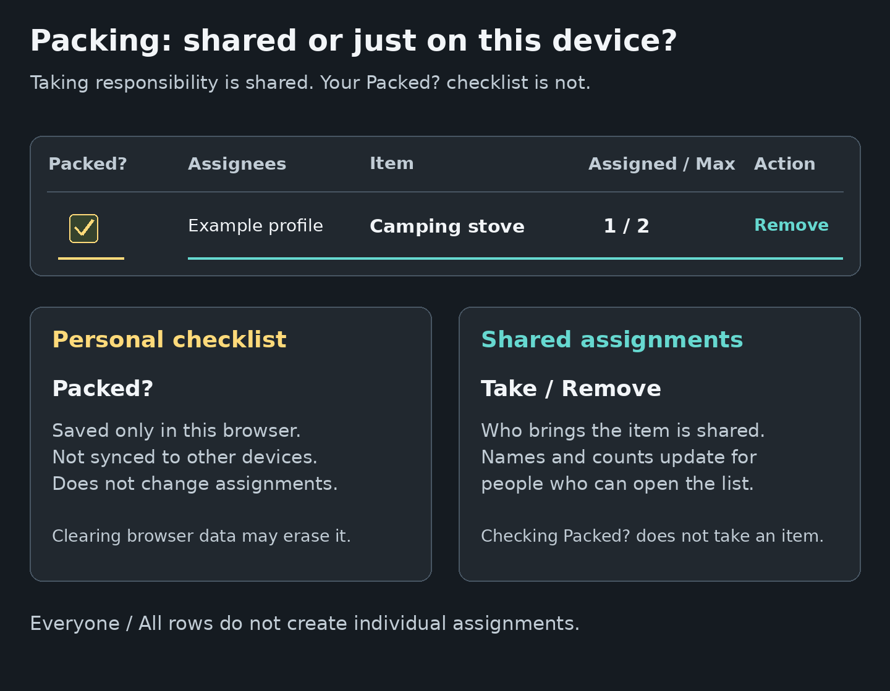

# Packing Lists
<!--
documentation-metadata
audience: packing-list participants; packing-list organizers
owner: packing-list feature maintainers
status: current
last-verified: 2026-09-06
verification-baseline: docs-baseline-2026-09-06-d14
verification-scope: D10 packing workflow plus D14 rendered-label assertions, shared-versus-local visual aid, per-page navigation, and trusted-help integration; D14 rendered help navigation, semantic checks, and trusted-content integration; D14 visual correction: measured and individually inspected shared-versus-local diagram
source-anchors: docs/user-guide/assets/packing-shared-vs-local.png; docs/HELP_VISUALS.md; tests/unit/help-documentation.spec.ts; src/views/packing/packing-create.pug; src/views/packing/packing-view.pug; src/public/js/packing-create.ts; src/public/js/packing.ts; src/routes/packing.ts; src/routes/api/packing.ts; src/controller/packingController.ts; src/middleware/guestFlowFactory.ts; src/middleware/assignFlowFactory.ts; src/middleware/entityHeaderUpdateHandler.ts; src/modules/database/entities/packing/PackingList.ts; src/modules/database/entities/packing/PackingItem.ts; src/modules/database/entities/packing/PackingAssignment.ts; src/modules/database/services/PackingService.ts; src/modules/lib/permissions.ts; src/views/event/event-dashboard.pug; src/views/modules/module_entity_header.pug; src/views/modules/module_unified_entity_cards.pug; tests/integration/packing-workflows.spec.ts; tests/integration/controller-smoke-workflows.spec.ts; src/controller/helpController.ts; tests/unit/help-documentation.spec.ts
next-review: packing-visible-UI-or-behavior-change
-->

Packing lists help a group divide shared equipment and remember personal essentials. A participant can volunteer for ordinary items, while an organizer can mark an item as something **Everyone** should bring.

> **Important: shared assignments and `Packed?` are different.** Names, assignment counts, item details, and the **Everyone** setting are shared with the group. A **Packed?** check mark is stored only in the current browser for that list item. It is not sent to Surveyor, is not tied to the active profile, and does not synchronize to another browser or device.

*This schematic row uses a fictional profile. The left-side check mark is personal to one browser; assignee names and assignment counts are shared application data.*

[View the packing-state image at full size](/help/assets/packing-shared-vs-local.png).

## Choose your task

- [Take an item or remove yourself](#take-an-item)
- [Use the personal Packed checklist](#use-packed-as-your-personal-checklist)
- [Understand Everyone items](#understand-everyone-items)
- [Open a list as a guest](#open-a-list-as-a-guest)
- [Create a packing list](#create-a-packing-list)
- [Add, edit, reorder, or delete items](#manage-list-content)
- [Link a list to an event](#link-a-packing-list-to-an-event)
- [Configure permissions and delegated organizers](#configure-sharing-and-permissions)
- [Duplicate or delete a list](#duplicate-or-delete-a-packing-list)
- [Troubleshoot a packing list](#troubleshooting)

## Understand the three kinds of state

| State | Who sees it | Where it is kept |
|---|---|---|
| Item title, description, maximum assignees, order, and **Everyone** setting | Everyone admitted to the list | Shared application data |
| Who selected **Take** and the **Assigned / Max** count | Everyone admitted to the list | Shared application data attached to profiles |
| **Packed?** check mark and green row highlight | Only that browser for that list item | Browser local storage |

Use assignments to coordinate responsibility. Use **Packed?** only as a personal reminder on the browser you will take with you.

## Open and read a packing list

Open the link supplied by the organizer, select the list from an event, or open it from [Your overview](DASHBOARD.md).

- When a profile is already active, Surveyor opens an unlinked packing list directly.
- Without an active profile, Surveyor sends you through the guest-entry page.
- An event-linked list normally requires registration for that event. A nonparticipant can enter only when the list grants effective **Access View** permission.

Check the active profile in the user menu before taking an item. Assignments belong to that profile, not to the full account as a whole.

### Read the summary counters

The top of the list shows:

- **Participants** — distinct profiles assigned to at least one ordinary item. A person assigned to several items is counted once. **Everyone** items do not add people to this counter.
- **Items** — all rows in the list, including **Everyone** items.
- **open** — ordinary items with at least one assignment place remaining.
- **unassigned** — ordinary items with no assignee. **Everyone** items are excluded because they do not use individual assignments.

### Read the item table

| Column | Meaning |
|---|---|
| **Packed?** | Your browser-local check mark for this item. |
| **Assignees** | Profile names of people who selected **Take**, or an **Everyone** badge for a shared requirement. |
| **Item** | What should be brought. |
| **Description** | Optional details, specification, or quantity guidance. |
| **Assigned / Max** | Number of assigned people and the maximum number of assignees for an ordinary item. |
| **Action** | **Take**, **Remove**, **Full**, **Everyone**, and any organizer controls available to your profile. |

The maximum is a number of **people**, not a count of physical objects. For example, use **Three folding tables** in the item title or description when one volunteer should bring all three; set **Max #** to the number of separate volunteers who may take responsibility.

## Take an item

For an ordinary item with an open assignment place:

1. Find the row.
2. Select **Take**.
3. Confirm that your profile name appears under **Assignees** and that **Assigned / Max** increases.

When the maximum is reached, the row shows **Full** and another participant cannot take it. A participant who is already assigned can still select **Remove**.

Taking an item requires effective **Access View** permission. Organizers can use [Permissions and Sharing](PERMISSIONS.md) when a participant can open the page but cannot complete the action.

### Remove yourself

1. Find an ordinary item assigned to the active profile.
2. Select **Remove** in the **Action** column.
3. Confirm that the profile name disappears and the count decreases.

The small **×** beside an assignee’s name is a separate organizer control for removing another person. Ordinary participants should use their own **Remove** button.

An item appears under **Your participation** in [Your overview](DASHBOARD.md) after the active profile takes at least one ordinary item. Merely opening the list, checking **Packed?**, or viewing an **Everyone** item does not create a shared assignment and therefore does not add the list to that participation collection.

## Understand Everyone items

An **Everyone** item is something each person is expected to bring for themselves, such as a water bottle, sleeping bag, identification document, or personal medication.

- During creation, the per-row switch is labelled **Everyone**.
- On an existing list, the editor switch in the **Action** column is labelled **All**.
- The **Assignees** column shows an **Everyone** badge instead of individual names.
- No participant selects **Take**, and the item is excluded from the open, unassigned, and participant counters.
- **Everyone** rows are highlighted and displayed before ordinary assignment rows.

The **All** switch changes whether the row uses individual assignments. It does not mean that Surveyor has confirmed that every person packed the item. Each participant may use their own browser-local **Packed?** checkbox as a reminder.

## Use Packed? as your personal checklist

Select the checkbox in the **Packed?** column when you have packed an item. The row turns green in that browser.

The check mark:

- is available for ordinary and **Everyone** items;
- does not assign the item to you;
- is not visible to the organizer or other participants;
- is not included in the participant or assignment counters;
- is stored under the list and item identifiers in that browser’s local storage;
- is not associated with a Surveyor account or profile.

The mark normally remains when you close and reopen the page in the same browser. It can disappear when you use another browser or device, open a private-browsing session, clear site data, or receive a duplicated list whose items have new identifiers. Another person using the same browser profile can see the same local check marks, even after the active Surveyor profile changes.

Do not use **Packed?** as proof that the group has completed a task. Use shared assignments and direct communication for group accountability.

## Open a list as a guest

A guest can participate when the list’s access rules allow it.

1. Open the packing-list link.
2. Select **Continue as guest** when no profile is active.
3. Enter a **Display name** and, preferably, an email address.
4. Save the private guest link sent or shown by Surveyor.
5. Use **Take**, **Remove**, and **Packed?** as described above when those actions are available.

An email address enables guest recovery. See [Getting Started — Recover guest access by email](GETTING_STARTED.md#recover-guest-access-by-email).

For an event-linked list, the guest profile must normally be registered for the event. A list-specific **Access View** grant can admit a nonparticipant. See [Events](EVENTS.md) for event registration and [Permissions and Sharing](PERMISSIONS.md) for the cumulative permission model.

## Create a packing list

Creation requires a signed-in full account. A guest can participate but cannot create a list. The active profile becomes the owner.

### 1. Open the creation form

1. Open **New** in the top navigation.
2. Under **Organize & share**, select **Packing list**.

An event organizer can instead open **Event administration dashboard**, expand **Event packing lists**, and select **Create new packing list**. That route opens the same form with the event selected.

### 2. Enter the list details

| Field | What to enter |
|---|---|
| **Title \*** | A required name participants will recognize. |
| **Description (optional)** | General instructions, meeting point, ownership rules, or other context. |
| **Header image(optional)** | An optional JPEG, PNG, or GIF image up to 10 MiB. |
| **Assign to event (optional)** | An active event managed by the current profile, or no event for a standalone list. |
| **Group Permissions** | Audience grants for viewing, editing, assignments, administration, duplication, and related actions. |

The creation form starts with the standard non-event permission defaults. Review [Permissions and Sharing](PERMISSIONS.md) before publishing sensitive names or granting edit actions.

### 3. Add the initial items

Under **Items to pack**, the table uses these columns:

| Column | What to enter |
|---|---|
| **Item** | Required item name. |
| **Description** | Optional specification, quantity, size, or coordination note. |
| **Max #** | Maximum number of people who may take an ordinary item; enter at least 1. |
| **Action** | Optional **Everyone** switch and the row-removal button. |

1. Complete the first row.
2. Select **Add row** for each additional item.
3. Enable **Everyone** for items every participant should bring personally.
4. Remove an unwanted row with its remove button.

At least one row with a nonblank item name is required. Empty rows are not part of the list.

### 4. Select **Create list**

Surveyor creates the list and all initial items together, then opens the shared list page. Check the visible item order, access rules, event link, and assignee limits before sharing the URL.

## Manage list content

Controls appear according to the active profile’s effective permissions. The owner receives every permission automatically.

### Edit the list description

A permitted editor sees **Double click to edit** above the description.

1. Double-click the description area.
2. Enter the revised text.
3. Save the inline edit.

### Add another item

A profile with **Item Add** sees **Add new item** at the bottom of the page.

1. Enter **Title \***.
2. Optionally enter **Description**.
3. Set **Max #** to the number of people who may take it.
4. Select **Add**.
5. To make the new row an **Everyone** item, enable its **All** switch after it appears.

### Edit an existing item

The page displays the hint **Double click to edit, drag to reorder** when the corresponding controls are available.

- Double-click **Item** to change the title.
- Double-click **Description** to change its details.
- Double-click the maximum value under **Assigned / Max** to change the assignee limit.
- Use **All** in the **Action** column to switch between an **Everyone** item and an ordinary assignment item.

Lowering an ordinary item’s maximum does not replace organizer review. Check the visible assignees and resolve any excess responsibility explicitly.

### Reorder items

A profile with **Item Edit** can drag rows into a new order. Surveyor stores the order for the shared list. **Everyone** rows remain grouped before ordinary rows when the page is displayed.

### Remove another participant

A profile with **Manage Assignments** sees a small **×** beside each assigned name. Select it to remove that profile’s assignment. This does not delete the profile or remove the person from a linked event.

### Delete an item

A profile with **Item Delete** sees a trash button on the row.

1. Select the trash button.
2. Confirm **Delete this item permanently?**

Deletion removes the item and all of its shared assignments. It cannot be undone through the application.

## Manage the header image

A profile with **Edit Meta** sees one of these controls in the list header:

- **Add image** when no header image exists;
- **Change image** and **Remove** when an image exists.

The upload accepts JPEG, PNG, and GIF images up to 10 MiB. Replacing or removing an image removes the previous stored file.

## Link a packing list to an event

Use **Assign to event (optional)** during creation when the list belongs to one event.

A linked list:

- appears under the event’s packing-list area for people allowed to see related event resources;
- shows **Go to event** in its header;
- normally admits profiles registered for that event;
- requires effective **Access View** for a nonparticipant;
- is deleted with the event because it is part of that event’s stored data.

The selected event must be an active event managed by the current profile. Creating from **Event packing lists** preselects that event.

Event registration and list permissions are separate. Registration can admit a participant to the linked page, while individual actions such as **Take**, adding items, editing rows, or managing assignments still use the packing list’s effective permissions.

## Configure sharing and permissions

Packing lists use the general cumulative permission system. A profile with **Manage Permissions** can expand **Administration Options** on the list page, then change **Group Permissions** or named **Administrators**.

Common packing-list permissions include:

| Goal | Relevant permission |
|---|---|
| Take or remove your own ordinary assignment | **Access View** |
| Edit the list description | **Edit Desc** |
| Add, replace, or remove the header image | **Edit Meta** |
| Add rows | **Item Add** |
| Reorder rows and broadly edit child items | **Item Edit** |
| Edit only item descriptions | **Item Edit Desc** |
| Delete rows | **Item Delete** |
| Remove other people’s assignments | **Manage Assignments** |
| Change group or administrator grants | **Manage Permissions** |
| Open the duplicate flow | **Data Duplicate** |

Item-specific grants can also authorize supported edits for one row. See [Permissions and Sharing](PERMISSIONS.md) for the complete labels, parent-item fallbacks, overlapping audiences, presets, owner behavior, and page-admission limitations.

### Privacy before sharing

Every person admitted to the packing-list page can see the visible list content, including assignee profile names. Packing lists do not provide anonymous assignments or an organizer-only assignee view.

The **Packed?** state is private only because it stays in that browser; it is not an access-control or audit feature. Avoid entering sensitive personal information in item titles, descriptions, or profile names.

## Duplicate or delete a packing list

### Duplicate a list

The owner can duplicate a list from **Overview** → **Your overview**:

1. Expand **Administrable entities**.
2. Find the packing list.
3. Select **Duplicate**.
4. Review the prefilled title, description, items, **Max #** values, and **Everyone** settings.
5. Review **Assign to event (optional)** and **Group Permissions** for the new list.
6. Select **Create list**.

The duplicate is an independent list with new item identifiers. It does not copy participant assignments, browser-local **Packed?** marks, or the header image. The active profile creating the copy becomes its owner.

### Delete a list

Only the owner can delete the complete list.

1. Open **Overview** → **Your overview**.
2. Expand **Administrable entities**.
3. Find the packing list and select **Delete**.
4. Confirm the deletion.

Deletion permanently removes the list, its items, its shared assignments, and its stored header image. Surveyor has no packing-list archive or restore action. A linked list is also removed when its event is deleted.

## Capabilities and limits

| Supported | Not provided |
|---|---|
| Shared item titles, descriptions, assignee limits, and ordering | Categories, sections, or nested items |
| Profile-based **Take** and **Remove** assignments | Assigning a numeric quantity to one person |
| **Everyone** requirements | Confirmation that every participant actually packed the item |
| Browser-local **Packed?** checklist | Cross-device, account-based, or organizer-visible packed status |
| Event-linked and standalone lists | A list deadline, automatic reminders, or change notifications |
| Delegated permissions and administrators | Anonymous assignee names |
| Header images, duplication, and permanent deletion | Packing-list export, archive, or in-app restore |

## Practical examples

### Shared camping equipment

Create ordinary rows such as **Group tent**, **Cooking stove**, and **First-aid kit**. Set **Max #** to the number of separate people who may volunteer. Put model, size, or physical quantity details in **Description**.

### Personal essentials

Enable **Everyone** for **Water bottle**, **Sleeping bag**, and **Identification**. Participants can then use **Packed?** as their own local checklist without creating redundant assignments.

### Event setup

Link a list to the event and create ordinary rows such as **Registration signs**, **Extension cables**, and **Projector**. Grant the event team only the editing and assignment permissions they need.

## Troubleshooting

### The list cannot be created

Check that:

- a full account, rather than a guest account, is signed in;
- **Title** is filled in;
- at least one item row has a nonblank **Item** value;
- every **Max #** is at least 1;
- the selected event is one the active profile may manage; and
- the header image is JPEG, PNG, or GIF and no larger than 10 MiB.

### **Take** is missing or does not work

Check whether:

- the item is marked **Everyone**, in which case no individual assignment is needed;
- the row is already **Full**;
- the active profile is already assigned and should use **Remove** instead; or
- the profile has effective **Access View** permission.

### An event-linked list says registration is required

Register the active profile for the event, or ask an organizer to grant list-specific **Access View** when nonparticipant access is intentional. Switching profiles can change both event registration and permissions.

### The list is missing from **Your overview**

Confirm the active profile.

- The owner and named administrators find the list under **Administrable entities**.
- A participant finds it under **Your participation** after taking at least one ordinary item.
- Viewing the list, checking **Packed?**, or relying only on **Everyone** rows does not create a shared assignment.

### My **Packed?** marks disappeared

Use the same browser profile and device. Private browsing, cleared site data, another browser, another device, or a duplicated list uses different local storage or identifiers. The organizer cannot restore these check marks because Surveyor never received them.

### Someone else can see my **Packed?** marks

The marks are browser-local, not profile-private. Anyone using the same browser profile for the same list can see them. Use a separate browser profile or clear the marks before handing over a shared device.

### Item-editing or organizer controls are missing

The active profile lacks the relevant permission. Ask the owner or a profile with **Manage Permissions** to review **Administration Options**. Remember that permission grants are cumulative across every matching audience and individual assignment.

### An item stays at the top of the list

Rows marked **All** are displayed before ordinary assignment rows. Turn off **All** when the item should use individual assignments, or reorder it within the appropriate group.

## Related guides

- [Getting Started](GETTING_STARTED.md) — Accounts, guests, recovery, and active profiles.
- [Your Overview](DASHBOARD.md) — Find participated-in and administrable lists.
- [Permissions and Sharing](PERMISSIONS.md) — Complete permission recipes and reference.
- [Events](EVENTS.md) — Event registration and linked resources.
- [User Guide Home](README.md) — All feature guides.
