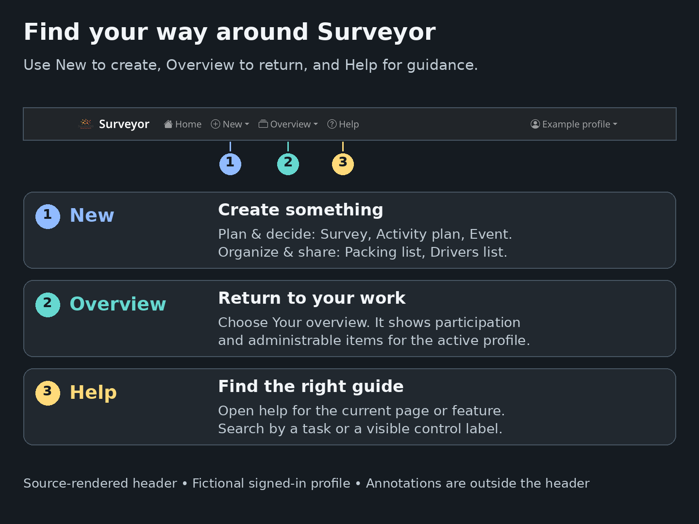
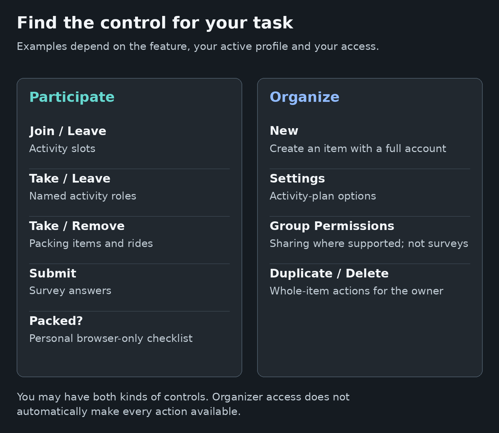

# Surveyor User Guide
<!--
documentation-metadata
audience: end users
owner: product documentation maintainers
status: current
last-verified: 2026-09-06
verification-baseline: docs-baseline-2026-09-06-d14
verification-scope: D14 task-grouped navigation, contextual help entry, server-side search, per-page tables of contents, maintained visual aids, rendered semantic checks, and trusted-content guardrails; D14 rendered help navigation, semantic checks, and trusted-content integration; D14 visual correction: source-derived header, individually inspected layouts, accurate captions and full-size image links
source-anchors: docs/user-guide/; docs/user-guide/assets/; docs/HELP_VISUALS.md; src/controller/helpController.ts; src/routes/help.ts; src/views/help.pug; src/views/layout.pug; src/public/style/help.sass; tests/unit/help-documentation.spec.ts; tests/e2e/help-experience.spec.ts; .github/workflows/release.yml
next-review: help-source-or-visible-UI-change
-->

Surveyor helps groups choose dates, organize events, coordinate packing and transport, and assign activities. Start with the path that matches how you entered the application.

## Find help quickly

The Help page groups guides by task instead of alphabetically. Use **Search help** when you know the task or a visible control label but not the feature name. On an application page, the navbar **Help** link opens the most relevant guide for that area. Inside a guide, use **On this page** to jump to a procedure or troubleshooting section.

*The header is rendered from the application source with a fictional signed-in profile; the numbered explanations are outside the screenshot. On a small screen, open the full-size image to inspect the header.*

[View the navigation image at full size](/help/assets/navigation-at-a-glance.png).

## Start here

### Create or use a full account

A Surveyor installation can provide local username-and-password accounts, organization sign-in, or both.

- For a local account, select **Register**, complete the form, activate the account from the email, and then log in.
- For organization sign-in, use **Login using _provider name_** or follow the automatic redirect. The first successful sign-in creates or connects the Surveyor account.
- After login, Surveyor opens **Your overview** with one active profile.

See [Getting Started](GETTING_STARTED.md) for account activation, password recovery, profile management, migration, and deletion.

### Join as a guest

Open the organizer’s invitation and select **Continue as guest**. A guest uses a display name and private access link instead of a password.

Enter an email address whenever possible. It lets Surveyor send the private link and later return all guest accounts connected to that address through **Login** → **Request access**. A guest can also open **Your overview** for items associated with that guest profile.

See [Join an invitation as a guest](GETTING_STARTED.md#join-an-invitation-as-a-guest) and [Recover guest access by email](GETTING_STARTED.md#recover-guest-access-by-email).

### Use the correct profile

A full account can contain several profiles; a guest account contains one. The active profile determines the displayed name, participation, ownership, and items shown in **Your overview**.

Use the profile name in the user menu to confirm who is active. Full-account users can select **Your profiles** to create or switch profiles. An existing guest or full-account profile can be moved to another full account with a 24-hour migration token.

See [Understand accounts and profiles](GETTING_STARTED.md#understand-accounts-and-profiles).

## Feature guides

- **[Your overview](DASHBOARD.md)** — Search, filter, and open the active profile’s participation and administrable items.
- **[Surveys](SURVEYS.md)** — Organize recurring monthly weekday patterns, vote **Yes**, **Maybe**, or **No**, read named results, and add combinations collaboratively. One named month is a supported secondary use case.
- **[Events](EVENTS.md)** — Register, update attendance, create and administer events, manage late links and participants, link plans/lists, and export sensitive participant data.
- **[Invoice Pools and Payments](INVOICE_POOLS.md)** — Submit and review receipts, allocate shared costs, manage takeovers and surcharges, calculate shares, and record settlement.
- **[Packing Lists](PACKING_LISTS.md)** — Coordinate ordinary item assignments and **Everyone** requirements, then use **Packed?** as a browser-local personal checklist.
- **[Activity Plans](ACTIVITY_PLANS.md)** — Join or leave slots, take named roles, create schedules, configure required participation, check coverage, review assignment suggestions, and export a print-friendly plan.
- **[Drivers Lists](DRIVERS_LISTS.md)** — Offer profile-owned rides, take passenger places, read deduplicated participant counters, and manage event-linked transport with explicit privacy boundaries.

## Permissions and sharing

Several Surveyor features use audience and individual permissions to control viewing, editing, assignments, and administration. Surveys deliberately use their own participation model rather than the general permission system.

The [Permissions and Sharing](PERMISSIONS.md) guide starts with common recipes, then explains cumulative grants, overlapping audiences, administrator delegation, every permission label, and the survey exception. Feature guides explain actions specific to each type of item.

*This is a control reference, not a screenshot. Controls appear according to the feature, active profile, registration state, ownership and effective permissions.*

[View the controls image at full size](/help/assets/participant-and-organizer-controls.png).

## Common controls

- Open **New** to start a **Survey**, **Activity plan**, **Event**, **Packing list**, or **Drivers list**. Creation requires a full account, and the active profile becomes the owner.
- Open **Overview** → **Your overview** to return to the active profile’s participation and administrable items.
- Use the search field and **Filter** menu inside each overview collection to narrow its cards.
- Open **Help** for these guides.
- Open the profile menu and select **Profile settings** to change the active profile’s displayed name.
- Full-account users can select **Your profiles** to create or switch identities.
- Select **Logout** when leaving a shared device. A guest should keep the private link or recovery email before logging out.

## Guide index

1. **[Getting Started](GETTING_STARTED.md)** — Accounts, activation, login, guest recovery, profiles, migration, and deletion.
2. **[Your overview](DASHBOARD.md)** — Profile-scoped participation, administration, search, filters, and owner actions.
3. **[Permissions](PERMISSIONS.md)** — Access and sharing for features that use the permission system.
4. **[Surveys](SURVEYS.md)** — Recurring monthly weekday-and-week-of-month choices as the primary use case, plus one-month planning, link sharing, guest participation, named results, and owner lifecycle controls.
5. **[Events](EVENTS.md)** — Event registration, deadlines, dietary data, administration, linked resources, export, and privacy.
6. **[Invoice Pools and Payments](INVOICE_POOLS.md)** — Event costs, invoice proof, review, shares, settlement, and retention.
7. **[Packing Lists](PACKING_LISTS.md)** — Shared assignments, Everyone/All requirements, event linkage, permissions, and a browser-local Packed checklist.
8. **[Activity Plans](ACTIVITY_PLANS.md)** — Participation, slot and role management, event gating, requirements, coverage, assignment recommendations, warnings, and schedule export.
9. **[Drivers Lists](DRIVERS_LISTS.md)** — Driver and passenger workflows, capacity, counters, event linkage, permissions, privacy, images, duplication, and deletion.
