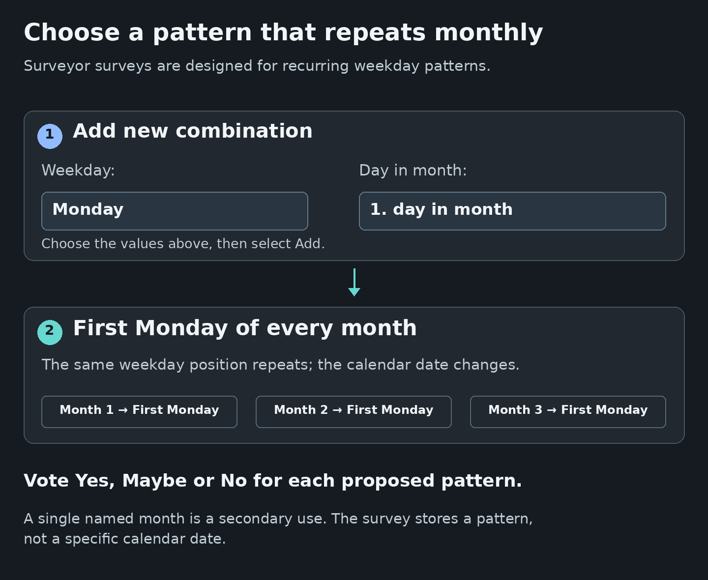

# Surveys
<!--
documentation-metadata
audience: survey participants; survey organizers
owner: survey feature maintainers
status: current
last-verified: 2026-09-06
verification-baseline: docs-baseline-2026-09-06-d14
verification-scope: D09 survey workflow plus D14 rendered-label assertions, recurring-use visual aid, per-page navigation, and trusted-help integration; D14 rendered help navigation, semantic checks, and trusted-content integration; D14 visual correction: measured and individually inspected recurring-pattern diagram with current option text
source-anchors: docs/user-guide/assets/survey-recurring-pattern.png; docs/HELP_VISUALS.md; tests/unit/help-documentation.spec.ts; src/views/surveyor/survey-create.pug; src/views/surveyor/survey-vote.pug; src/public/js/survey-create.ts; src/routes/survey.ts; src/routes/api/survey.ts; src/controller/surveyController.ts; src/middleware/guestFlowFactory.ts; src/middleware/entityHeaderUpdateHandler.ts; src/modules/database/entities/surveys/Survey.ts; src/modules/database/entities/surveys/SurveyCombination.ts; src/modules/database/entities/surveys/SurveyResponse.ts; src/modules/database/services/SurveyService.ts; src/views/modules/module_entity_header.pug; src/views/modules/module_unified_entity_cards.pug; tests/integration/survey-workflows.spec.ts; tests/e2e/core-workflows.spec.ts; docs/decisions/DEC-001-SURVEY-COMBINATION-AUTHORIZATION.md; docs/decisions/DEC-005-SURVEY-CREATION-PERMISSIONS.md; src/controller/helpController.ts; tests/unit/help-documentation.spec.ts
next-review: survey-visible-UI-or-behavior-change
-->

Surveys are designed primarily for organizing **recurring monthly dates**, such as choosing whether a group should meet on the first Monday, second Wednesday, or last Friday of every month. This recurring-pattern workflow is the feature’s main strength: participants answer **Yes**, **Maybe**, or **No** once for each easy-to-understand weekday position.

A survey can also compare options within one named month as a secondary use case. Put that month and year in the title or description, because the survey stores weekday positions rather than concrete calendar dates. When the decision is mainly about several exact dates, a date-specific polling service may offer a more direct experience; use Surveyor when the recurring monthly pattern is the important part.

*This explanatory diagram uses the current field labels and the example values Monday and 1. day in month. The recurring first-Monday result is a pattern, not a concrete calendar date.*

[View the recurring-pattern image at full size](/help/assets/survey-recurring-pattern.png).

## Choose your task

- [Vote in a survey](#vote-in-a-survey)
- [Return as a guest](#return-as-a-guest)
- [Read the results](#read-the-results)
- [Add another combination](#add-another-combination)
- [Create and share a survey](#create-a-survey)
- [Manage, duplicate, or delete a survey](#manage-a-survey)

## Understand the recurring monthly model

Each option combines one weekday with one position in a month.

| Combination | Meaning |
|---|---|
| **1. Monday of the month** | The first Monday in the month being discussed. |
| **3. Wednesday of the month** | The third Wednesday in that month. |
| **Last (4./5.) Friday of the month** | The final Friday, which can be the fourth or fifth Friday. |

The available positions are **1**, **2**, **3**, **4**, and **Last**. There is no separate fifth-week option; use **Last** for the final occurrence of a weekday.

For the primary recurring use case, a survey titled **Monthly committee meeting** can compare **1. Tuesday**, **2. Wednesday**, and **Last Thursday** as patterns that repeat every month.

For the secondary one-month use case, a survey titled **October 2026 planning day** can compare **1. Saturday**, **2. Sunday**, and **Last Friday**. The month and year come from the title and description, not from the combinations themselves.

## Vote in a survey

### 1. Open the survey link

Use the link supplied by the organizer.

- When a profile is already active, the voting page opens directly.
- Otherwise, the join page offers **Log in**, **Recover guest account**, **Create account**, and **Continue as guest**.

A guest enters a **Display name** and may enter an email address. Entering an email is strongly recommended because Surveyor sends the private guest link and can later recover guest accounts associated with that address.

### 2. Check the active profile

The profile name shown in the user menu is the identity attached to the ballot. A full account with several profiles should switch to the intended profile before voting.

### 3. Choose one answer for every combination

Under **Your response**, select:

- **Yes** — the option works well.
- **Maybe** — the option could work if needed.
- **No** — the option does not work.

Surveyor initially shows **No** for an option that this profile has not answered yet.

### 4. Select **Submit**

**Submit** saves the complete ballot shown on the page. Submitting again replaces that profile’s previous ballot, so check every column before saving.

After the first submission, the survey appears under **Your participation** in [Your overview](DASHBOARD.md) for that profile.

## Change an answer

1. Open the survey from **Your participation** or use the original survey link.
2. Change any **Yes**, **Maybe**, or **No** selections.
3. Select **Submit** again.

The new submission replaces the previous ballot for the active profile. Surveyor does not provide a separate action for removing a ballot or hiding the participant’s name from the results.

## Return as a guest

A guest can return with the private link shown after joining and sent by email when an email address was supplied.

When that link is unavailable:

1. On the survey join page, select **Recover guest account**; or open **Login** and use the guest-recovery option.
2. Enter the email address used for the guest profile.
3. Open the recovery email and choose the correct guest account when several are associated with that address.
4. Return to the survey link or open it from **Your overview** after the guest session is restored.

See [Getting Started — Recover guest access by email](GETTING_STARTED.md#recover-guest-access-by-email) for the complete recovery procedure.

## Read the results

The voting page contains two result areas.

### **Your response**

This row shows the selections currently displayed for the active profile. Changes are not saved until **Submit** is selected.

### **All answers**

The table shows:

- one row for every profile that has submitted a ballot;
- one column for every survey combination;
- the participant’s profile or guest display name;
- green for **Yes**, yellow for **Maybe**, and red for **No**.

When a combination is added after people have already voted, their existing result rows show **No** in the new column until they return and submit another answer.

Surveyor does not calculate a winner, score, or ranked result. Compare the columns and decide which option best fits the group. A useful approach is to look first for the most **Yes** answers, then use **Maybe** answers to distinguish close options.

### Result visibility and privacy

Every person admitted to the survey can see **All answers**, including participant display names and their selections. Surveys do not support anonymous ballots or private organizer-only results.

Share the survey only with the intended group, and remember that a recipient can forward the link to another person.

## Add another combination

Adding options is collaborative. **Every participant admitted to the voting page may add a combination**, including:

- the owner;
- a participant using a full account; and
- a registered guest.

No organizer or administrator role is required.

1. Scroll to **Add new combination**.
2. Under **Weekday:**, choose Monday through Sunday.
3. Under **Day in month:**, choose **1. day in month**, **2. day in month**, **3. day in month**, **4. day in month**, or **Last (4./5.) day in month**.
4. Select **Add**.

The option appears as a new column for everyone. Each weekday-and-position combination can occur only once in a survey.

Existing participants are not notified automatically. When an option is added after voting has begun, tell them to return and submit an updated ballot. Combinations cannot be removed after the survey has been created, so add late options carefully.

## Create a survey

Creation requires a signed-in full account. A guest can participate in surveys but cannot create one. The active profile becomes the owner.

### 1. Open the creation form

1. Open **New** in the top navigation.
2. Under **Plan & decide**, select **Survey**.

### 2. Enter the survey details

| Field | What to enter |
|---|---|
| **Survey Title \*** | A required name that tells participants what decision they are making. Include the month or other date context when relevant. |
| **Description** | Optional instructions, background, a response deadline, or an explanation of how the final choice will be made. |
| **Header image (optional)** | A JPEG, PNG, or GIF image up to 10 MiB. |

Surveyor does not enforce a survey response deadline. A date written in the description is informational, so the organizer must communicate and enforce it outside the application.

### 3. Add at least one combination

The **Select date combinations** table starts with one row.

1. Choose a **Weekday**.
2. Choose the **Week of month**: **1**, **2**, **3**, **4**, or **Last**.
3. Select **Add combination** for another row.
4. Select **Remove** beside a row that should not be included.

At least one valid, unique combination is required.

### 4. Select **Create Survey**

The new survey opens on its voting page. The owner can vote in the same way as every other participant.

## Understand survey access before sharing

Surveys deliberately use a simple, survey-specific participation model. They do **not** use the **Group Permissions** matrix available for events, activity plans, packing lists, and drivers lists.

The survey link is the invitation boundary:

- a person with an active full-account profile can open it directly;
- a person without an active profile can log in, create an account, recover a guest account, or continue as a guest;
- every admitted participant can vote, see all submitted answers, and add combinations;
- only the owner receives the owner lifecycle controls described below.

There are no audience presets, individual permission assignments, co-administrator assignments, or read-only participant roles for surveys. Treat the link as group information and send it only to people who should participate and see the named results.

## Share a survey

Surveyor does not require the organizer to add participants in advance.

1. Open the survey after creating it.
2. Copy its address from the browser.
3. Send that link through the group’s usual communication channel.
4. Tell participants what **Yes**, **Maybe**, and **No** should mean for this decision and when you need their response.

A participant who submits a ballot can later find the survey under **Your participation** for the same profile.

## Surveys and events

Surveys are standalone. They do not have **Assign to event**, do not appear in an event’s linked-resource sections, and do not inherit event registration or event permissions.

A survey can still help choose or discuss an event date: put the relevant month or event name in the survey title or description and share the survey link separately.

## Manage a survey

### Header image

The owner can manage the image from the survey page:

- **Add image** when no image is present;
- **Change image** to replace it;
- **Remove** to delete it.

The replacement file must be JPEG, PNG, or GIF and no larger than 10 MiB.

### Title and description

Surveyor does not provide in-place editing for a survey title or description after creation. Check them before sharing. To create a revised independent survey, use **Duplicate** and edit the prefilled form before creating the copy.

### Duplicate a survey

Only the owner sees the overview-card action.

1. Open **Overview** → **Your overview**.
2. Expand **Administrable entities**.
3. Find the survey and select **Duplicate**.
4. Review the prefilled title, description, and combinations.
5. Change anything needed and select **Create Survey**.

The duplicate is a new survey with its own link and no participant responses. The header image is not copied; upload one on the new survey when required.

### Delete a survey

Only the owner sees the overview-card action.

1. Open **Overview** → **Your overview**.
2. Expand **Administrable entities**.
3. Find the survey and select **Delete**.
4. Confirm the deletion.

Deletion permanently removes the survey, all combinations, all submitted answers, and its stored header image. Surveyor has no survey archive or restore action.

## Practical examples

### Primary use: choose a recurring monthly meeting pattern

Create **Monthly committee meeting** with:

- **1. Tuesday**;
- **2. Wednesday**; and
- **Last Thursday**.

Participants vote on which recurring position usually works best.

### Secondary use: choose a day within one stated month

Create **October 2026 workshop** and explain in the description that all combinations refer to October 2026. Add:

- **1. Saturday**;
- **2. Sunday**; and
- **Last Saturday**.

The survey stores the ordinal weekday pattern, while the title and description supply the month and year. This works, but the interface remains optimized for recurring patterns rather than exact-date comparison.

### Compare regular volunteer days

Create **Monthly equipment check** with several weekday positions, then ask volunteers to use **Maybe** only when they could attend with advance notice.

## Capabilities and limits

| Supported | Not supported |
|---|---|
| Weekday plus first, second, third, fourth, or last occurrence in a month | Selecting a specific calendar date, month, year, or time |
| **Yes**, **Maybe**, and **No** ballots | Preference ordering, numeric scores, or automatic winner selection |
| Full-account and guest participation | Anonymous voting or private answers |
| All-answer table with participant names | Organizer-only result visibility |
| Collaborative addition of new combinations | Removing or editing an existing combination |
| Owner header-image controls | Editing the title or description in place after creation |
| Owner duplication and permanent deletion | Closing, archiving, or enforcing a response deadline |
| Standalone link sharing | Event linkage or the general permission matrix |

## Troubleshooting

### The survey cannot be created

Check that:

- a full account, rather than a guest account, is signed in;
- **Survey Title** is filled in;
- at least one combination remains in the table;
- the same weekday-and-position combination is not repeated; and
- the header image is JPEG, PNG, or GIF and no larger than 10 MiB.

### The survey is missing from **Your overview**

Confirm the active profile first.

- The owner finds it under **Administrable entities**.
- A participant finds it under **Your participation** after submitting a ballot with that profile.
- Merely opening the link or adding a combination does not create a participant ballot.

### A guest cannot return

Use **Recover guest account** on the join page or the guest-recovery option from **Login**, then use the email address entered when the guest profile was created. See [Getting Started](GETTING_STARTED.md#recover-guest-access-by-email).

### A new combination shows **No** for earlier voters

That is the displayed default until each participant returns and submits a choice for the new column. Ask participants to revisit the survey.

### The **Add** action reports an error

Check whether the same weekday-and-position combination is already present. A survey cannot contain duplicate combinations.

### Permission or event controls cannot be found

They are not part of surveys. Share the standalone survey link with the intended group. Use [Permissions and Sharing](PERMISSIONS.md) only for the other feature types that implement the general permission system.

### Image, **Duplicate**, or **Delete** controls are missing

Switch to the owner profile. These lifecycle controls are owner-only and the overview actions appear under **Administrable entities**.

## Related guides

- [Getting Started](GETTING_STARTED.md) — Accounts, guests, recovery, and profiles.
- [Your Overview](DASHBOARD.md) — Find owned and participated-in surveys.
- [Permissions and Sharing](PERMISSIONS.md) — The general model used by other feature types and the survey exception.
- [Events](EVENTS.md) — Create and manage an event after the group has chosen a date.
- [User Guide Home](README.md) — All feature guides.
